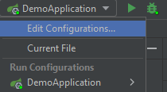
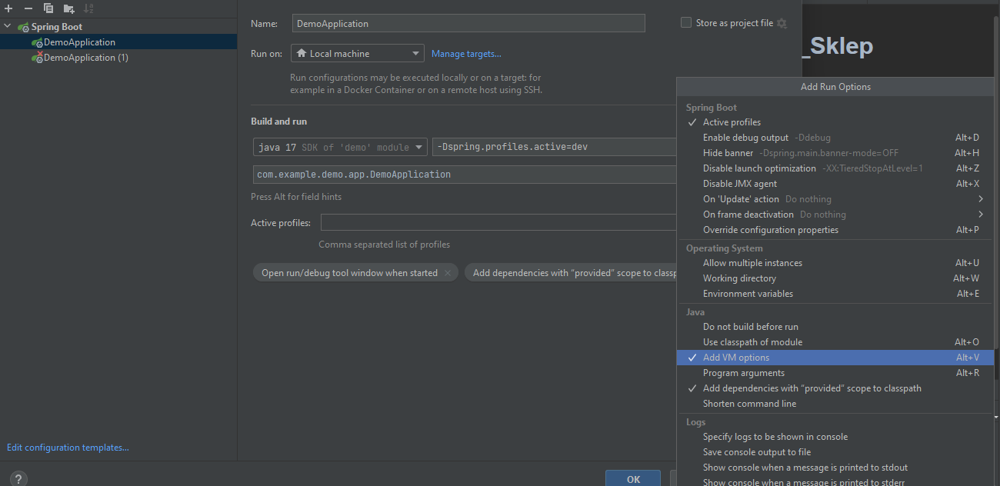

# Program_Zesp_2_Sklep

### Prerequisites:

1. Docker
2. IntelliJ (Ultimate version is recommended)
3. Java 17
4. Maven

### How to start?

1. Download docker from https://www.docker.com
2. Download and Create default container for PostgreSQL
3. Create schema called ```storedb``` in ```postgres``` database on your docker container
4. Verify that port for database connection in ```src/main/resources/application-dev.yml``` is same as in your docker container
5. Load maven project (Popup in IntelliJ should show up, if no open maven tab in top right corner and press 'reload all maven projects')
6. Go to 'edit configuration' and set up as you see on screenshot<br />
 <br />
<br />
```-Dspring.profiles.active=dev```
7. Run application<br />
